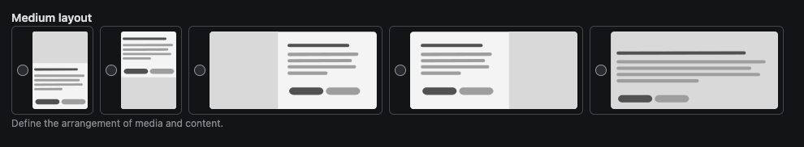

<h1 align="center">Contao Radio Image Widget</h1>
<p align="center">
    <a href="https://github.com/zoglo/contao-radio-image-widget"></a>
    <a href="https://packagist.org/packages/zoglo/contao-radio-image-widget"></a>
    <a href="https://packagist.org/packages/zoglo/contao-radio-image-widget"></a>
</p>

## Description

This bundle adds a widget that renders radio buttons with an image instead of a text label. Unlike Contao's `radioTable`
the image is not the stored value.
The widget will look for a file named after the value in `eval.imagePath`.
SVG and PNG are supported, SVG wins if both exist.



## Installation

### Via composer

```
composer require zoglo/contao-radio-image-widget
```

## Configuration

```php
$GLOBALS['TL_DCA']['tl_content']['fields']['foobar'] = [
    'exclude'   => true,
    'inputType' => 'radioImage',
    'options'   => ['left', 'center', 'right', 'justify'],
    'reference' => &$GLOBALS['TL_LANG']['MSC'],
    'eval'      => ['imagePath'=>'bundles/mybundle/images/', 'tl_class'=>'w50'],
    'sql' => [
        'type' => 'string',
        'length' => '16',
        'default' => 'left',
    ],
];
```

The example above would render the following images: `public/bundles/mybundle/images/left.svg`, `center.svg`, `right.svg`, `justify.svg`.

### With an options callback

```php
$GLOBALS['TL_DCA']['tl_content']['fields']['foobar'] = [
    'exclude'      => true,
    'inputType'    => 'radioImage',
    'eval'         => [
        'imagePath'=>'bundles/mybundle/images/',
        'tl_class'=>'w50'
    ],
];
```

The widget reads `arrOptions` the same way `select` does, so `options`, `options_callback` and `enum` all work
unchanged. An option with `'default' => true` is preselected while the field is empty.

### Options

| Key                | Value                | Description                                                                                                                                    |
|--------------------|----------------------|------------------------------------------------------------------------------------------------------------------------------------------------|
| `inputType`        | `radioImage`         |                                                                                                                                                |
| `options`          | `array`              | An options array. Values are plain keys, **not** paths.                                                                                        |
| `options_callback` | `function\|callable` | A callback function that returns the options array.                                                                                            |
| `enum`             | `class-string`       | A backed enum whose cases provide the options. Labels come from `TranslatableLabelInterface::label()` if implemented.                          |
| `reference`        | `array`              | Reference an array that will be used to translate the options. Contao will automatically match the options and reference array by key.         |
| `eval.imagePath`   | `string`             | Directory of the images, relative to the project root or the web directory (same resolution order as `Contao\Image`). Trailing slash optional. |
| `eval.cols`        | `integer`            | Radio buttons per row. Defaults to the number of options, i.e. a single row.                                                                   |

An option with an empty value, such as the one added by `eval.includeBlankOption`, has no image and renders its label
as text.

## Template

Lives in `@Contao/backend/widget/radio_image.html.twig` and can be overridden through the template hierarchy. It receives:

Images are rendered with `backend_icon()`, so width and height are set from the image,
dark theme variants (`side--dark.svg`) are supported by default.
